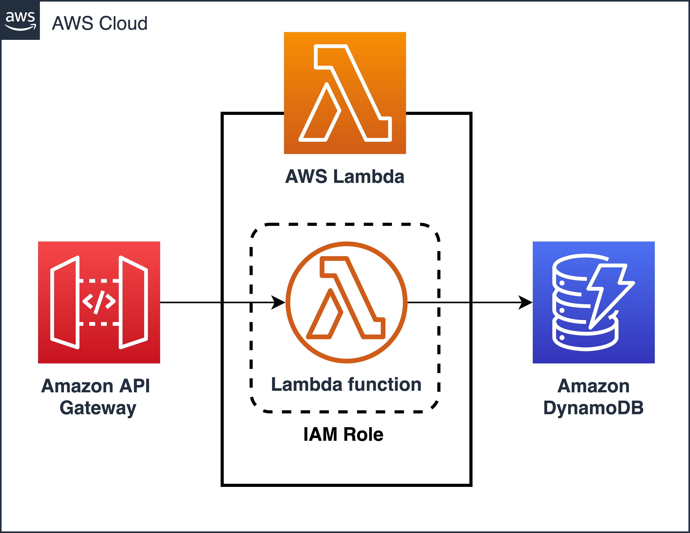

# mod-aws-cdk-api-rest

[](https://docs.aws.amazon.com/cdk/v2/guide/getting_started.html)

> Module that allows the creation of Screts in SecretManager and its dependencies.

>
> ## Table of Contents

- [mod-aws-cdk-api-rest](#mod-aws-cdk-api-rest)
  - [Table of Contents](#Table-of-Contents)
  - [Diagram](#Diagram)
  - [Prerequisites](#Prerequisites)
  - [Providers](#Providers)
  - [Inputs](#Inputs)
  - [Outputs](#Outputs)
  - [Example usage](#Example-usage)
  - [Basic Invocation Example](#Basic%20Invocation%20Example%20with%20Lambda)
  - [Custom Invocation Example](#Custom%20Invocation%20Example%20with%202%20or%20More%20Paths)

## Diagram



## Prerequisites

You will need the following things properly installed on your computer.

- [Git](http://git-scm.com/)
- [Node](https://nodejs.org/en/download)
- [npm](https://docs.npmjs.com/downloading-and-installing-node-js-and-npm)
- [CDK](https://docs.aws.amazon.com/cdk/v2/guide/getting_started.html#getting_started_install)
- [JavaScript](https://developer.mozilla.org/es/docs/Web/JavaScript)

## Requirements


## Providers

| Name | Version |
| ---- | ------- |
|   |      |

## Inputs

| Name                  | Description                                                    | Type           | Default | Required |
| --------------------- | -------------------------------------------------------------- | -------------- | ------- | :------: |
| Name                  | Custom Api Name.                                               | `string`       | n/a     |   yes    |
| Description           | Custom Description for Api Name.                               | `string`       | n/a     |   yes    |
| Handler               | Custom Lambda Name to Attach.                                  | `string`       | n/a     |   yes    |
| Proxy                 | Custom Proxy Service.                                          | `boolean`      | n/a     |   yes    |
| Stage                 | Custom Stage Name for API.                                     | `string`       | n/a     |   yes    |
| Resources             | Array that includes one or more path and one or more methods.  | `array`        | n/a     |   yes    |
| Path                  | Custom Path Name to Resource                                   | `string`       | n/a     |   yes    |
| Methods               | Custom Method.                                                 | `array/string` | n/a     |   yes    |


## Outputs

| Name  | Description                                 |
| ----- | ------------------------------------------- |
|  |  |

## Example usage

- This module allows the creation of a basic Rest API with necessary paths and methods


### Basic Invocation Example with Lambda

```CDK
Add in package.json

"dependencies": {
    "aws-cdk-lib": "latest",
    "constructs": "latest",
    "ApiRestModule": "gitlab:mauriciogonzalezferia/mod-aws-cdk-api-rest",
    "LambdaModule": "gitlab:mauriciogonzalezferia/mod-aws-cdk-lambda"
  }

#################################################################

const cdk = require('aws-cdk-lib');
const { LambdaModule } = require('LambdaModule/lambda-module');
const { ApiRestModule } = require('ApiRestModule/api-rest-module');

// Your Custom Stack
class CdkStack extends cdk.Stack {
  constructor(scope, id, props) {
    super(scope, id, props);

    // Inside your custom stack

    // Create Lambda Funtion
    const myLambda = new ApiRestModule(this, 'MyLambda', {
      runtime: 'NODEJS_18_X',    // Runtime for the Code
      code: 'lambda',   // Path relative to your project
      handler: 'index.handler',    // File Name and Funtion Name
      timeout: 30      // Time for the execute Funtion
    });

    // Create API to Lambda
    const api = new ApiRestModule(this, 'HelloApi', {
      Name: 'API-Service',      // Custom API Name
      Description: 'Description for the Api Service',      // Custom Description
      Handler: myLambda,        // Existing Custom Lambda
      Proxy: false,     // Boolean Variable
      Stage: 'prod',    // Custom Stage Name
      Resources: [
        {
          Path: 'anyResources',     // Custom Path
          Methods: ['GET'],     // Custom Method
        },
      ],
    });
  }
}

module.exports = { CdkStack };   // Your Custom Stack

```

### Custom Invocation Example with 2 or More Paths and Methods

```CDK
Add in package.json

"dependencies": {
    "aws-cdk-lib": "latest",
    "constructs": "latest",
    "ApiRestModule": "gitlab:mauriciogonzalezferia/mod-aws-cdk-api-rest",
    "LambdaModule": "gitlab:mauriciogonzalezferia/mod-aws-cdk-lambda"
  }

#################################################################

const cdk = require('aws-cdk-lib');
const { LambdaModule } = require('LambdaModule/lambda-module');
const { ApiRestModule } = require('ApiRestModule/api-rest-module');

// Your Custom Stack
class CdkStack extends cdk.Stack {
  constructor(scope, id, props) {
    super(scope, id, props);

    // Inside your custom stack

    // Create Lambda Funtion
    const myLambda = new ApiRestModule(this, 'MyLambda', {
      runtime: 'NODEJS_18_X',    // Runtime for the Code
      code: 'lambda',   // Path relative to your project
      handler: 'index.handler',    // File Name and Funtion Name
      timeout: 30      // Time for the execute Funtion
    });

    // Create API to Lambda
    const api = new ApiRestModule(this, 'HelloApi', {
      Name: 'API-Service',      // Custom API Name
      Description: 'Description for the Api Service',      // Custom Description
      Handler: myLambda,        // Existing Custom Lambda
      Proxy: false,     // Boolean Variable
      Stage: 'prod',    // Custom Stage Name
      Resources: [
        {
          Path: 'anyResources',     // Custom Path
          Methods: ['GET'],     // Custom Method
        },
        {
          Path: 'anotherResource',      // Custom Path
          Methods: ['GET', 'DELETE'],   // Custom Method
        },
        {
          Path: 'additionalResource',       // Custom Path
          Methods: ['PUT', 'PATCH'],        // Custom Method
        },
      ],
    });
  }
}

module.exports = { CdkStack };   // Your Custom Stack

```
